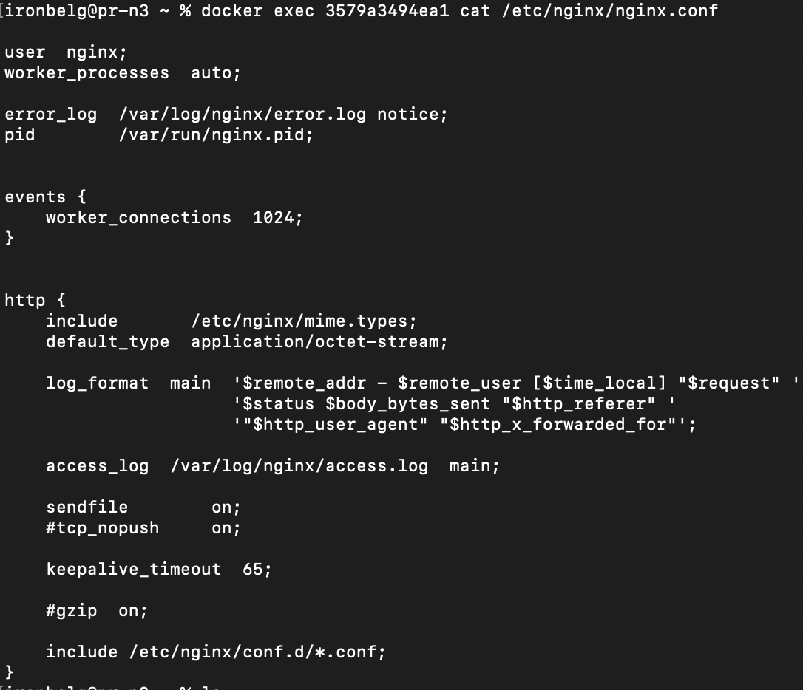

## Part 1. Готовый докер  
#### 1) Взял официальный докер образ с `nginx` и выкачал его при помощи `docker pull` 

#### 2) Проверил наличие докер образа через `docker images`

#### 3) Запустил докер образ через `docker run -d [image_id|repository]`

#### 4) Проверил, что образ запустился через `docker ps`

#### 5) Посмотрел информацию о контейнере через `docker inspect [container_id|container_name]`

#### 6) Остановил докер образ через `docker stop [container_id|container_name]`

#### 7) Проверил, что образ остановился через `docker ps`

#### 8) Запустил докер с портами 80 и 443 в контейнере, замапленными на такие же порты на локальной машине, через команду `run`

#### 9) Проверил, что в браузере по адресу `localhost:80` доступна стартовая страница `nginx`

#### 10) Перезапустил докер контейнер через `docker restart [container_id|container_name]`

#### 11) Проверил, что контейнер запустился

## Part 2. Операции с контейнером

#### 1) Прочитал конфигурационный файл `nginx.conf` внутри докер контейнера через команду exec

#### 2) Создал на локальной машине файл `nginx.conf`

#### 3) Настроил в нем по пути `/status` отдачу страницы статуса сервера `nginx`

#### 4) Скопировал созданный файл `nginx.conf` внутрь докер образа через команду docker `cp`

#### 5) Перезапустил nginx внутри докер образа через команду `exec`

#### 6) Проверил, что по адресу `localhost:80/status` отдается страничка со статусом сервера `nginx`

#### 7-8) Экспортировал контейнер в файл `container.tar` через команду `export` и остановил контейнер

#### 9) Удалил образ через docker `rmi` `[image_id|repository]`, не удаляя перед этим контейнеры

#### 10) Удалил остановленный контейнер

#### 11) Импортировал контейнер обратно через команду `import`

#### 12-13) Запустил импортированный контейнер и проверил, что по адресу `localhost:80/status` отдается страничка со статусом сервера `nginx`

## Part 3. Мини веб-сервер

#### 1) Написал мини сервер на `C` и `FastCgi`

#### 2) Написал свой `nginx.conf`, который будет проксировать все запросы с `81` порта на `127.0.0.1:8080`

#### 3) Перенес созданные файлы:

#### 4) Вошел в контейнер:

#### 5) Запустил написанный мини сервер через `spawn-fcgi` на порту `8080`

#### 6) Проверил, что в браузере по `localhost:81` отдается написанная страница

## Part 4. Свой докер

#### 1) Написал свой докер образ: 

#### 2) Собрал написанный докер образ через `docker build`:

#### 3) Проверил через `docker images`, что все собралось корректно

#### 4) Запустил собранный докер образ с маппингом 81 порта на 80 на локальной машине  и маппингом папки `./nginx` внутрь контейнера по адресу, где лежат конфигурационные файлы `nginx'а`:

#### 6) Дописал в `./nginx/nginx.conf` проксирование странички `/status`, по которой надо отдавать статус сервера `nginx`:

#### 7) Перезапустил докер образ:

#### 8) Все проверил: 

## Part 5. Dockle

#### 1) Установил `dockle`:

#### 2) Просканировал образ:

#### 3) Исправил `Dockerfile` так, чтобы не было ошибок:

#### 4) Все проверил: 

## Part 6. Базовый Docker Compose

#### 1) Написал файл `docker-compose.yml`:

#### 2) Переделал `nginx.conf`,для проксирования:

#### 3) Собрал и запустил проект:

#### 4) Все проверил: 
